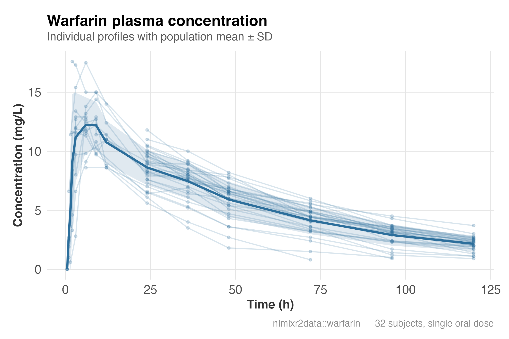
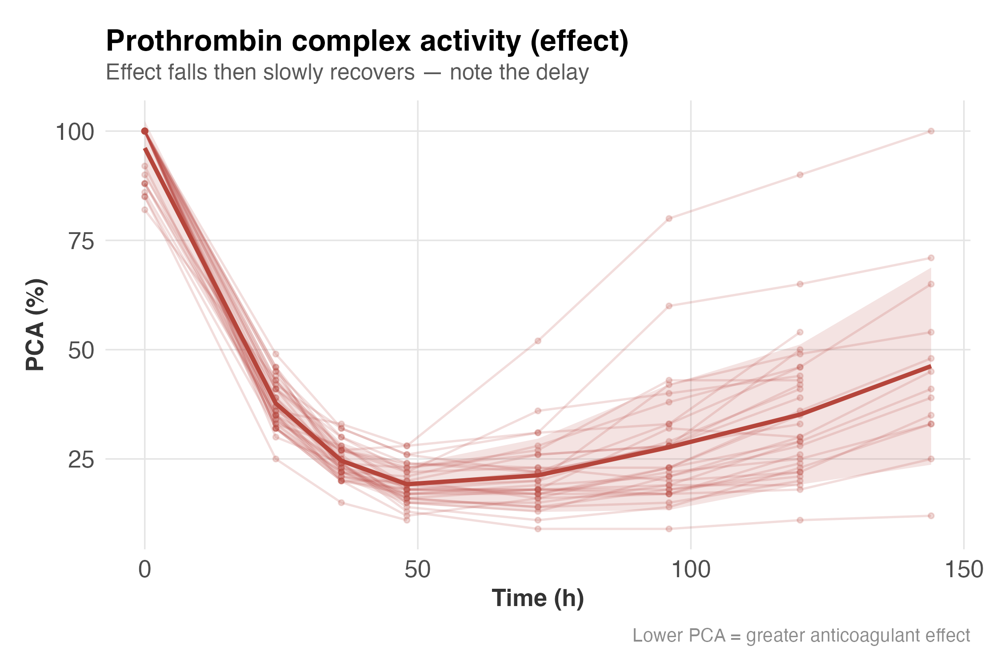
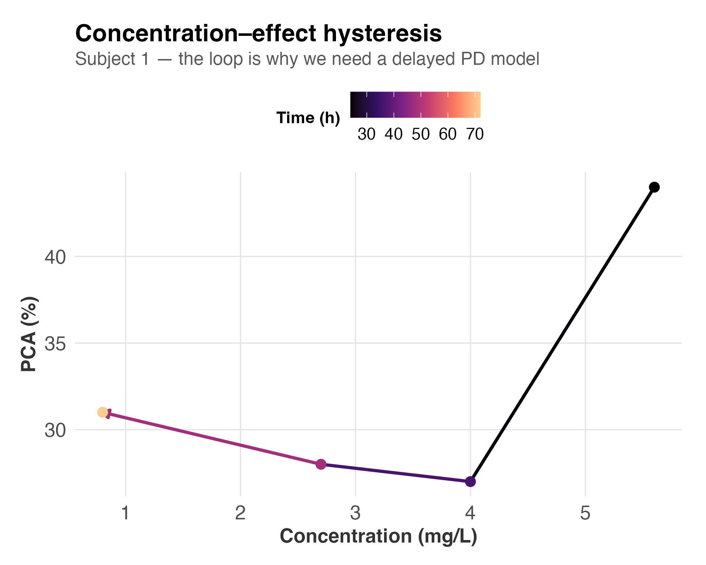
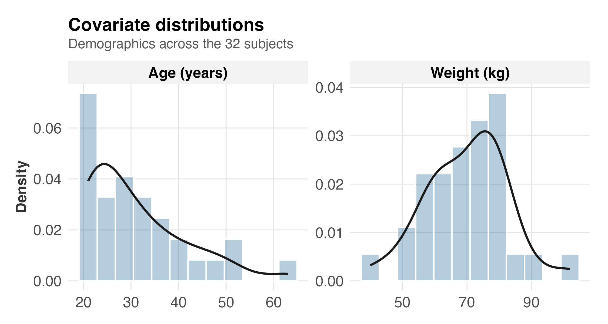
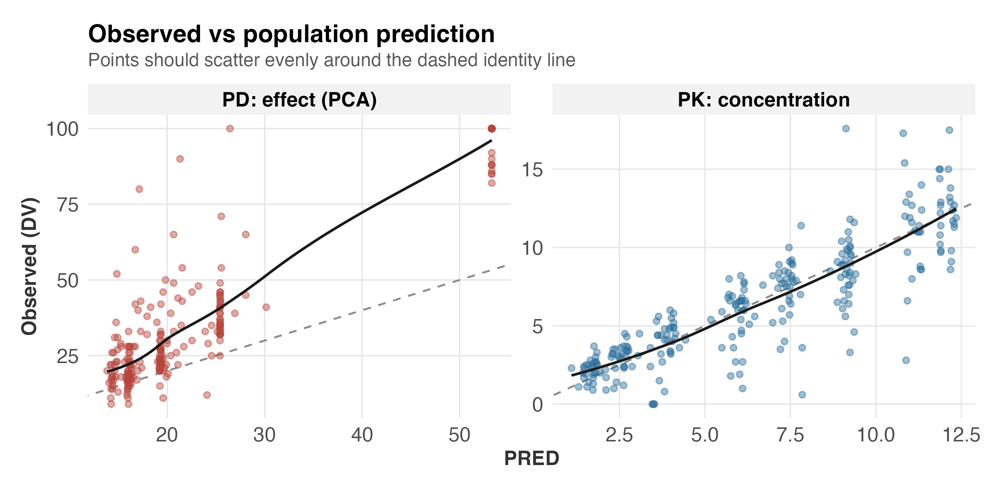
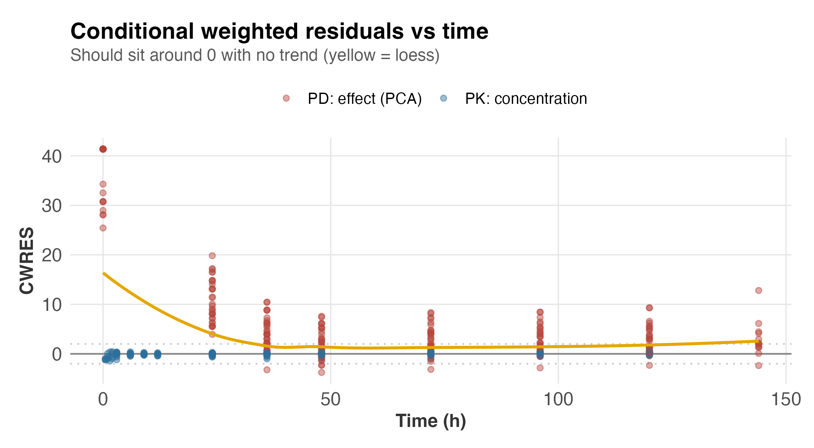
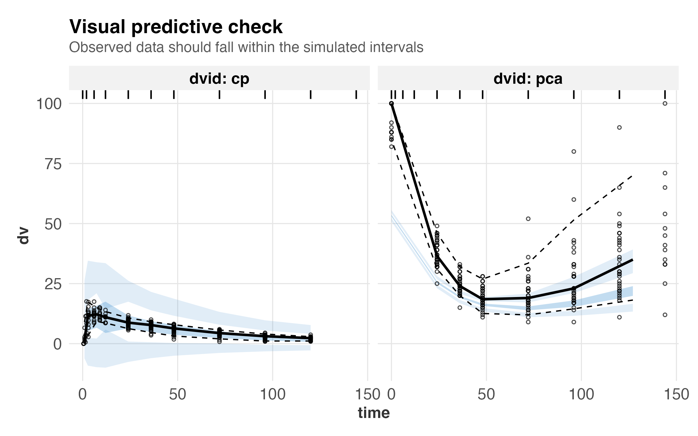
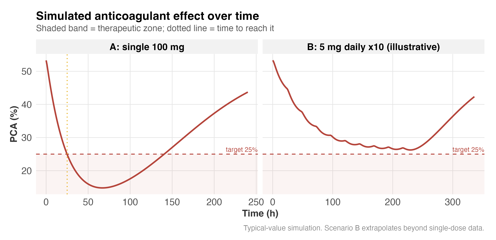
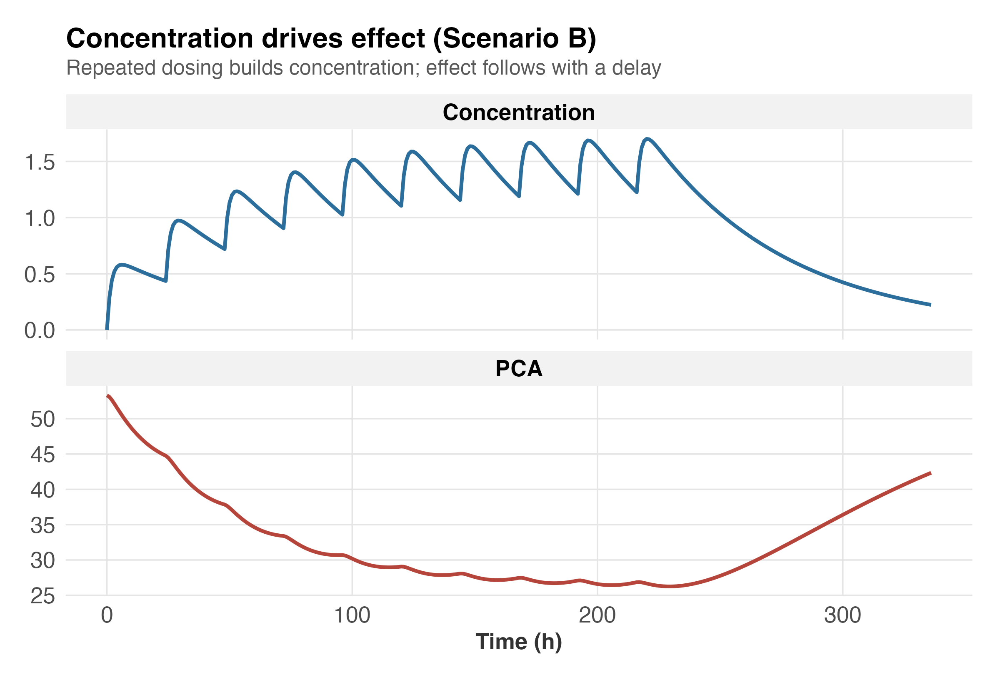

::: {.callout-note appearance="simple"}
A reproducible population PK/PD analysis of warfarin built in R with
**nlmixr2**. Figures and parameter tables are pre-computed by the pipeline
(`scripts/01`–`08`) and embedded here, so this report renders quickly without
re-fitting the models.
:::

## About this analysis {.unnumbered}

**What.** A population pharmacokinetic/pharmacodynamic (PK/PD) model of the
anticoagulant warfarin, linking dose to plasma concentration to anticoagulant
effect, with dosing simulations.

**Data.** The `warfarin` dataset from the `nlmixr2data` package (O'Reilly study:
32 subjects, single oral dose, plasma concentration and prothrombin complex
activity, with weight/age/sex). Bundled with the software, so fully
reproducible.

**Methods.** Nonlinear mixed-effects modelling with `nlmixr2` (SAEM). A
one-compartment first-order-absorption PK model (selected over a two-compartment
alternative by AIC); an indirect-response *turnover* PD model, chosen because
the concentration–effect data show hysteresis; a joint PK/PD fit with
allometric body-weight covariates on clearance and volume; model checking by
goodness-of-fit, CWRES, and a visual predictive check; and dosing simulations
via `rxode2`.

**Key results.** Clearance ≈ 0.135 L/h and volume ≈ 7.6 L; estimated weight
exponents (≈ 0.71 on CL, ≈ 1.05 on V) close to allometric theory; adding weight
cut unexplained between-subject variability in clearance from ≈ 25% to ≈ 6%.

**Reproduce / learn more.** Run `scripts/01`–`08` in order; see `README.md`,
the beginner walkthrough in `LEARNING_NOTES.md`, and the full tutorial book in
`book/`.

*Author: Pramod BR · Effect readout is PCA, not INR · Multi-dose simulations
are illustrative extrapolations of single-dose data.*

# Objective

Describe the pharmacokinetics of warfarin (how the body absorbs and clears it),
link concentration to its anticoagulant effect — prothrombin complex activity
(**PCA**) — and use the fitted model to simulate dosing scenarios.

Warfarin is an ideal case study: a narrow therapeutic window, a well-understood
mechanism (inhibition of clotting-factor synthesis), and a clear *delay*
between concentration and effect that the model must capture.

# Data

Source: the `warfarin` dataset from **`nlmixr2data`** (O'Reilly study — 32
subjects, single oral dose, plasma concentration `cp` and effect `pca`, with
weight, age and sex). It ships with the package, so nothing is downloaded.

# Exploratory analysis

Individual profiles with the population mean ± SD. Concentration rises then
falls; effect falls then slowly recovers.

::: {layout-ncol=2}

:::

The concentration–effect relationship forms a **loop**, not a single line —
effect lags concentration. This hysteresis is why the PD model must be a
delayed, indirect-response (turnover) model rather than a direct one.

{width=70%}

# PK model

A one-compartment model with first-order oral absorption was selected over a
two-compartment alternative (lower AIC). Parameters: absorption rate (`ka`),
clearance (`CL`) and volume (`V`).



# PD model

An indirect-response **turnover** model: warfarin inhibits production (`kin`)
of the clotting-factor pool via an Imax relationship, so PCA declines with a
delay and recovers as the drug clears.



# Joint PK/PD model

PK and PD fit simultaneously, with body weight added on clearance and volume.
The weight exponents came out close to the classic allometric values, and
between-subject variability on clearance dropped sharply versus the separate
fits.



# Diagnostics

Goodness-of-fit and residual plots confirm the joint model describes both
endpoints well.

::: {layout-ncol=2}

:::

{width=80%}

# Simulation

Using the fitted typical-value parameters, we simulate a single 100 mg dose
(matching the study) and an illustrative 5 mg daily maintenance regimen. The
shaded band marks an illustrative therapeutic zone.

{width=70%}



# Conclusions

This workflow demonstrates an end-to-end population PK/PD analysis: data
handling, exploratory analysis, structural and covariate model building,
diagnostics, and simulation. The measured readout is PCA; INR relates to PCA
clinically but is not measured in this dataset, so it is not reported here. The
maintenance-dose simulation extrapolates beyond the single-dose data and is
labelled as illustrative.

::: {.callout-tip appearance="simple"}
Full method and beginner-friendly explanation: see `LEARNING_NOTES.md`.
Reproduce everything by running `scripts/01`–`08` in order.
:::
